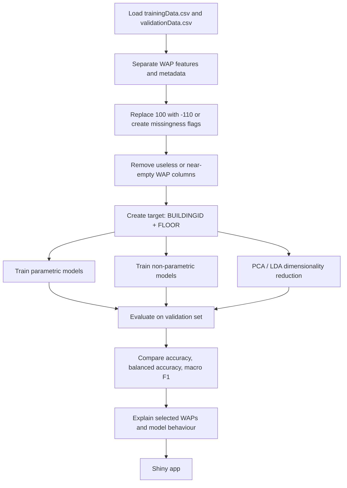

## Verdict

**Yes — UJIIndoorLoc is appropriate for this capstone project**, especially for a project about:

> **Indoor positioning from WiFi fingerprints using machine learning.**

It fits the assignment very well because it has:

* **High dimensionality:** 520 WiFi signal features.
* **Enough samples:** 19,937 training rows + 1,111 validation rows.
* **Classification targets:** building, floor, building-floor.
* **Regression targets:** longitude and latitude.
* **Feature correlation and redundancy:** useful for PCA, LDA, ridge/lasso/elastic net.
* **Realistic data issues:** sparse WiFi signals, device/user shift, temporal validation split.

The best project direction is:

> **Predict indoor building + floor from WiFi fingerprints, then optionally estimate 2D location.**

This matches the assignment requirement to choose **two ML scenarios**, use models with **several dozen parameters**, document preprocessing, compare models, and build a **Shiny app** with dynamic model fitting. 

---

# 1. Assignment requirement analysis

The assignment requires a dataset that supports:

| Requirement                      | UJIIndoorLoc fit? | Comment                                                               |
| -------------------------------- | ----------------: | --------------------------------------------------------------------- |
| **Real-world problem**           |          ✅ Strong | Indoor localization is a real engineering problem.                    |
| **Raw-ish data**                 |            ✅ Good | CSVs contain raw WiFi RSSI fingerprints.                              |
| **High-dimensional modelling**   |       ✅ Excellent | 520 WAP features.                                                     |
| **Regression or classification** |       ✅ Excellent | UCI explicitly lists both tasks.                                      |
| **Several dozen parameters**     |       ✅ Excellent | 520 predictors before preprocessing.                                  |
| **Two ML scenarios**             |       ✅ Excellent | Scenarios 2, 3, 4, and 5 are suitable.                                |
| **Explainability discussion**    |          ✅ Strong | Feature importance, coefficients, selected WAPs, PCA loss.            |
| **Shiny app**                    |        ✅ Feasible | User can select target, model, feature preprocessing, PCA components. |
| **Enough samples**               |             ✅ Yes | 21,048 total instances.                                               |

The assignment asks you to avoid pre-solved workflows and to work with data that still needs cleaning and analysis. It also asks for reproducible documentation, model comparison, selected visualizations, a one-page summary, and a Shiny application. 

UJIIndoorLoc is from **UCI**, not Kaggle. That is good. But it is a known benchmark dataset, so you should **not reuse published notebooks or solutions**. Build your own preprocessing, modelling, evaluation, and Shiny app.

---

# 2. Official dataset metadata

According to UCI, **UJIIndoorLoc** is a multi-building, multi-floor indoor localization dataset for testing indoor positioning systems based on **WLAN / WiFi fingerprinting**. It covers **three buildings** at Universitat Jaume I, with **4 or more floors** and almost **110,000 m²**. UCI lists the associated tasks as **classification** and **regression**. ([UCI Machine Learning Repository][1])

Officially, the dataset has:

| Property                         |                        Value |
| -------------------------------- | ---------------------------: |
| **Total instances**              |                       21,048 |
| **Training/reference records**   |                       19,937 |
| **Validation/test records**      |                        1,111 |
| **Total attributes**             |                          529 |
| **WiFi WAP features**            |                          520 |
| **Buildings**                    |                            3 |
| **Floors**                       |                          0–4 |
| **Missing values**               |            Officially no NaN |
| **Special missing-signal value** | `100` means WAP not detected |

The important detail is this:

> `100` is **not a real signal strength**.
> It means the access point was **not detected**.

Real RSSI values are negative, approximately from **-104 dBm to 0 dBm**. UCI confirms that `100` is used when a WAP was not detected. ([UCI Machine Learning Repository][1])

---

# 3. Dataset structure

Each row represents one WiFi scan.

## Main feature groups

| Columns                 | Meaning                  | Use in ML                                |
| ----------------------- | ------------------------ | ---------------------------------------- |
| `WAP001`–`WAP520`       | WiFi RSSI fingerprint    | ✅ Main predictors                        |
| `LONGITUDE`, `LATITUDE` | Position coordinates     | ✅ Regression targets                     |
| `FLOOR`                 | Floor number             | ✅ Classification target                  |
| `BUILDINGID`            | Building ID              | ✅ Classification target                  |
| `SPACEID`               | Room / area ID           | ⚠️ Usually avoid as predictor            |
| `RELATIVEPOSITION`      | Inside / outside space   | ⚠️ Usually avoid as predictor            |
| `USERID`                | Person who recorded scan | ⚠️ Use for bias analysis, not prediction |
| `PHONEID`               | Android device           | ⚠️ Use for domain-shift analysis         |
| `TIMESTAMP`             | Scan time                | ⚠️ Use for split/bias analysis           |

For a realistic ML system, the cleanest setup is:

```text
Input:
  WAP001 ... WAP520

Targets:
  BUILDINGID
  FLOOR
  or BUILDINGID + FLOOR
  or LONGITUDE + LATITUDE
```

Avoid using `SPACEID`, `RELATIVEPOSITION`, `USERID`, `PHONEID`, or `TIMESTAMP` as ordinary predictors unless you clearly justify it.

---

# 4. Actual CSV exploration

I loaded both uploaded files:

| File                 |   Rows | Columns |
| -------------------- | -----: | ------: |
| `trainingData.csv`   | 19,937 |     529 |
| `validationData.csv` |  1,111 |     529 |

There are **no NaN values** in either file.

But there is encoded WiFi missingness:

```text
100 = WAP not detected
```

So this dataset is sparse even though it has no NaN.

---

## 4.1 WiFi sparsity

| Metric                        | Training | Validation |
| ----------------------------- | -------: | ---------: |
| WAP columns                   |      520 |        520 |
| Detected WAP values           |    3.46% |      3.17% |
| Average WAPs detected per row |    17.99 |      16.48 |
| Median WAPs detected per row  |       17 |         15 |
| Max WAPs detected per row     |       51 |         35 |
| Rows with zero WAPs detected  |       76 |          0 |

This is very important.

The model does **not** see dense 520-dimensional numeric data.
It sees mostly “not detected” values.

Recommended preprocessing:

```text
Option A:
  Replace 100 with -110
  Reason: -110 means weaker than the weakest observed signal.

Option B:
  Use two feature sets:
    1. signal strength with 100 -> -110
    2. binary detected/not-detected flags

Option C:
  Remove WAPs that are never or almost never detected.
```

---

## 4.2 WAP coverage mismatch

| Metric                                    | Count |
| ----------------------------------------- | ----: |
| WAPs detected at least once in training   |   465 |
| WAPs never detected in training           |    55 |
| WAPs detected at least once in validation |   367 |
| WAPs common to train and validation       |   312 |
| WAPs only seen in validation              |    55 |
| WAPs only seen in training                |   153 |

This is a real deployment-like problem.

Some validation access points were **not seen during training**, so supervised models cannot learn useful weights for them.

This is not a blocker, but it must be documented.

Best approach:

* Keep the same 520-column schema.
* Treat unseen WAPs carefully.
* Report that train/validation have **WAP availability shift**.
* Prefer robust models: **regularized linear models**, **random forest**, **PCA**, **feature selection**.

---

## 4.3 Target distribution

### Building distribution

| Building | Training rows | Validation rows |
| -------: | ------------: | --------------: |
|        0 |         5,249 |             536 |
|        1 |         5,196 |             307 |
|        2 |         9,492 |             268 |

The training set is imbalanced toward **building 2**.

### Floor distribution

| Floor | Training rows | Validation rows |
| ----: | ------------: | --------------: |
|     0 |         4,369 |             132 |
|     1 |         5,002 |             462 |
|     2 |         4,416 |             306 |
|     3 |         5,048 |             172 |
|     4 |         1,102 |              39 |

Floor 4 has fewer samples, especially in validation.

### Building-floor classes

There are **13 building-floor combinations** in both training and validation.

That is good for classification.

Minimum training class size is still large enough for modelling.
Validation has some small classes, so use:

* **accuracy**
* **balanced accuracy**
* **macro F1**
* per-class confusion matrix

Do not rely only on accuracy.

---

## 4.4 Metadata shift

| Metadata          |                 Training | Validation |
| ----------------- | -----------------------: | ---------: |
| Users             |                       18 |          1 |
| Phones            |                       16 |         11 |
| Spaces            |                      123 |          1 |
| Training period   | 2013-05-30 to 2013-06-20 |            |
| Validation period | 2013-09-19 to 2013-10-08 |            |

This means the validation set is not just a random split.

It tests generalization across:

* different time period,
* different user,
* different phones,
* different WAP visibility.

That is good for a realistic project.

But it also means `USERID`, `SPACEID`, and `RELATIVEPOSITION` should **not** be used as normal predictors.

---

# 5. Feature correlation analysis

The WiFi features are highly sparse and partly redundant.

After replacing `100` with `-110`, I checked pairwise WAP correlations.

| Correlation metric                   |   Value |        |       |
| ------------------------------------ | ------: | ------ | ----- |
| Non-constant WAP features            |     465 |        |       |
| Pairwise WAP pairs checked           | 107,880 |        |       |
| Mean absolute correlation            |   0.040 |        |       |
| Median absolute correlation          |   0.011 |        |       |
| 95th percentile absolute correlation |   0.147 |        |       |
| 99th percentile absolute correlation |   0.619 |        |       |
| Maximum absolute correlation         |   0.997 |        |       |
| Pairs with `                         |       r | > 0.8` | 366   |
| Pairs with `                         |       r | > 0.7` | 765   |
| Pairs with `                         |       r | > 0.5` | 1,453 |

Top highly correlated WAP pairs:

| Pair                | Correlation |
| ------------------- | ----------: |
| `WAP208` / `WAP209` |       0.997 |
| `WAP499` / `WAP514` |       0.996 |
| `WAP492` / `WAP498` |       0.987 |
| `WAP498` / `WAP513` |       0.984 |
| `WAP053` / `WAP054` |       0.981 |

Interpretation:

* Many WAPs are almost duplicates.
* This is expected because nearby access points are detected together.
* Linear models may suffer from multicollinearity.
* **Ridge**, **elastic net**, **PCA**, and **feature selection** are highly appropriate.

---

# 6. Feature relevance to targets

I tested WAP features against the combined **building-floor** target.

Using ANOVA-style feature scoring on signal values:

| Result                | Count |
| --------------------- | ----: |
| WAPs with `p < 0.001` |   437 |
| WAPs with `p < 0.05`  |   439 |

Top WAPs by signal-value relevance:

```text
WAP139
WAP138
WAP087
WAP501
WAP481
WAP096
WAP097
WAP495
```

Using chi-square scoring on binary detected/not-detected values:

| Result                | Count |
| --------------------- | ----: |
| WAPs with `p < 0.001` |   416 |
| WAPs with `p < 0.05`  |   430 |

Top WAPs by detection-pattern relevance:

```text
WAP481
WAP096
WAP097
WAP501
WAP138
WAP139
WAP087
WAP516
```

Interpretation:

* The WAPs are strongly informative.
* Both **signal strength** and **presence/absence** matter.
* Because many features are significant, feature selection should focus on **generalization**, not only p-values.

---

# 7. PCA / dimensionality reduction suitability

The dataset is very suitable for PCA/LDA-style analysis.

Using standardized non-constant WAP features:

| PCA components | Explained variance |
| -------------: | -----------------: |
|              2 |             10.65% |
|              5 |             19.10% |
|             10 |             28.35% |
|             20 |             39.26% |
|             30 |             46.35% |
|             50 |             55.64% |
|             75 |             64.04% |
|            100 |             70.32% |

Approximate thresholds:

| Threshold    | Components needed |
| ------------ | ----------------: |
| 50% variance |     37 components |
| 70% variance |     99 components |

Interpretation:

* PCA is useful, but the signal is distributed across many dimensions.
* A 2D PCA plot may be useful for visualization, but not enough for modelling.
* PCA will reduce dimensionality, but it will reduce explainability because components are mixtures of many WAPs.

This directly supports **assignment scenario 5**.

---

# 8. Quick baseline modelling results

These are not final project results, only a suitability check.

## 8.1 Building classification

| Model               | Accuracy | Balanced accuracy | Macro F1 |
| ------------------- | -------: | ----------------: | -------: |
| Logistic Regression |    1.000 |             1.000 |    1.000 |
| Random Forest       |    0.999 |             0.999 |    0.999 |

Building prediction is almost solved.

So **building-only classification is too easy** for the main project.

Use it only as a first stage or baseline.

---

## 8.2 Floor classification

| Model               | Accuracy | Balanced accuracy | Macro F1 |
| ------------------- | -------: | ----------------: | -------: |
| Logistic Regression |    0.879 |             0.882 |    0.869 |
| Random Forest       |    0.910 |             0.879 |    0.895 |

Floor prediction is harder and more interesting.

---

## 8.3 Building-floor classification

Target: combined class like `Building 2, Floor 3`.

| Model                | Accuracy | Balanced accuracy | Macro F1 |
| -------------------- | -------: | ----------------: | -------: |
| Gaussian Naive Bayes |    0.408 |             0.480 |    0.386 |
| Logistic Regression  |    0.882 |             0.885 |    0.870 |
| Random Forest        |    0.912 |             0.895 |    0.897 |

This is a strong project target.

It is not trivial, but good models perform well.

---

## 8.4 Coordinate regression

Target: `LONGITUDE`, `LATITUDE`.

| Model                   | Mean 2D error | Median 2D error | 95th percentile 2D error |
| ----------------------- | ------------: | --------------: | -----------------------: |
| Mean baseline           |        143.33 |          166.97 |                   226.38 |
| Ridge regression        |         49.77 |           35.88 |                   133.56 |
| Random Forest Regressor |         12.45 |            8.08 |                    39.79 |

Coordinate regression is also suitable.

However, classification is easier to explain and defend.

Best project setup:

```text
Primary task:
  Building-floor classification

Secondary task:
  Coordinate regression inside predicted building/floor
```

---

# 9. Most suitable assignment scenarios

## Recommended scenario pair

### Scenario A — Parametric vs non-parametric models

This matches assignment scenario 2.

Use target:

```text
BUILDINGID + FLOOR
```

Parametric models:

* **Multinomial logistic regression**
* **LDA**
* **Gaussian Naive Bayes**
* optionally **ridge / elastic-net logistic regression**

Non-parametric models:

* **Random forest**
* **kNN**
* **Decision tree**
* optionally **gradient boosting**

Why this is suitable:

* Clear classification task.
* Enough samples.
* 13 classes.
* Many features.
* Good explainability comparison.

---

### Scenario B — Dimensionality reduction before modelling

This matches assignment scenario 5.

Compare:

* **No dimensionality reduction**
* **PCA + classifier**
* **LDA projection + classifier**
* optionally **selected WAP subset + classifier**

Good research question:

> Can dimensionality reduction reduce 520 WiFi features while keeping accurate indoor floor localization?

This is very defensible.

---

## Alternative scenario pair

### Scenario 3 — Feature selection

This is also suitable.

Compare:

* forward / backward / mixed selection,
* lasso,
* ridge,
* elastic net.

But there is one risk:

> Stepwise selection over 520 features can be computationally expensive and unstable.

Better approach:

1. Remove WAPs with very low detection rate.
2. Keep maybe top 100–150 candidate WAPs.
3. Run stepwise / lasso / elastic net on that reduced set.
4. Compare selected WAPs and performance.

This gives a strong explainability story.

---

## Scenario 4 — Heatmaps and tree diagrams

This is suitable, but more as a supporting scenario.

Useful visualizations:

* heatmap of median RSSI per building-floor class,
* heatmap of WAP detection rate per class,
* decision tree trained on selected WAPs,
* confusion matrix heatmap.

Risk:

* A full 520-feature heatmap will be unreadable.
* Use selected WAPs only.

---

# 10. Recommended final project design

## Proposed project title

**Indoor localization from WiFi fingerprints using interpretable machine learning**

## Main hypothesis

> WiFi fingerprint patterns contain enough information to classify the user’s building and floor, and dimensionality reduction or feature selection can reduce the 520-dimensional signal space while preserving most predictive performance.

## Main target

```text
BUILDINGID + FLOOR
```

This gives 13 classes.

## Secondary target

```text
LONGITUDE + LATITUDE
```

Use this for regression extension.

---

# 11. Recommended ML pipeline



---

# 12. Shiny app ideas

A good Shiny app could include:

| UI control               | Purpose                                                   |
| ------------------------ | --------------------------------------------------------- |
| Select target            | Building, floor, building-floor, coordinates              |
| Select preprocessing     | `100 -> -110`, binary detected flags, remove rare WAPs    |
| Select model             | Logistic regression, random forest, kNN, LDA, PCA + model |
| PCA slider               | Number of components                                      |
| Feature filter slider    | Minimum WAP detection rate                                |
| Model parameter controls | Trees, max depth, k neighbors, regularization             |
| Output                   | Accuracy, macro F1, confusion matrix, feature importance  |
| Visualization            | PCA scatter, RSSI heatmap, predicted vs true floor        |

This directly fits the assignment requirement that the Shiny app should allow **data loading, function fitting, and dynamic parameter adjustment**. 

---

# 13. Risks and how to handle them

| Risk                          | Why it matters                                                    | Fix                                         |
| ----------------------------- | ----------------------------------------------------------------- | ------------------------------------------- |
| `100` is not a real value     | It means WAP not detected                                         | Replace with `-110` or add binary flags     |
| Sparse data                   | Only ~3.46% of WAP values are detected                            | Use feature filtering and regularization    |
| Correlated WAPs               | Some WAPs are almost duplicates                                   | Use ridge, elastic net, PCA                 |
| Building-only target too easy | Accuracy almost 100%                                              | Use building-floor or floor target          |
| Validation class imbalance    | Some classes have few rows                                        | Use macro F1 and balanced accuracy          |
| Metadata leakage              | `SPACEID`, `USERID`, `PHONEID` may not be available in deployment | Use WAPs as main predictors                 |
| Train/validation shift        | Validation has different users/time/devices                       | Treat official validation as realistic test |
| Known benchmark dataset       | Many public solutions exist                                       | Do your own workflow and document it        |

---

# 14. Final recommendation

Use this dataset.

But do **not** make the project only about predicting `BUILDINGID`.
That task is too easy.

Best project setup:

> **Primary:** classify **building-floor** from WiFi fingerprints.
> **Secondary:** compare coordinate regression as an extension.

Best assignment scenarios:

1. **Scenario 2:** compare parametric vs non-parametric models.
2. **Scenario 5:** apply PCA/LDA before classification and evaluate explainability loss.

Strong model comparison:

| Model family             | Models                                         |
| ------------------------ | ---------------------------------------------- |
| Parametric               | logistic regression, LDA, Gaussian Naive Bayes |
| Regularized / embedded   | ridge, lasso, elastic net                      |
| Non-parametric           | random forest, kNN, decision tree              |
| Dimensionality reduction | PCA + logistic regression, LDA + classifier    |

Final judgement:

> **UJIIndoorLoc is highly suitable for the capstone.**
> It has enough samples, enough features, real sparsity, correlated predictors, clear classification and regression targets, and strong support for explainability, feature selection, dimensionality reduction, and model comparison.

[1]: https://archive.ics.uci.edu/dataset/310/ujiindoorloc "UCI Machine Learning Repository"
